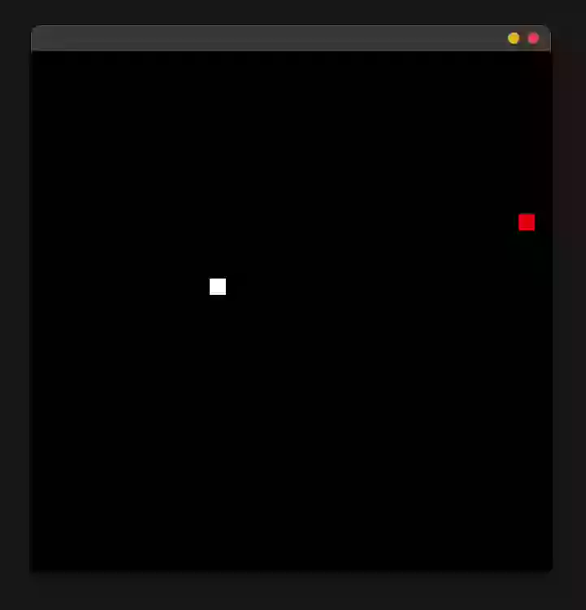

# Simple snake game

Simple snake game in Golang using [Ebitengine](https://github.com/hajimehoshi/ebiten)

Only snake, only appels.



The project is over a year old.

# How to run?

## Prerequirements

- Go
- [Ebitengine deps](https://ebitengine.org/en/documents/install.html)


## Running
```bash
go run ./main.go
```
